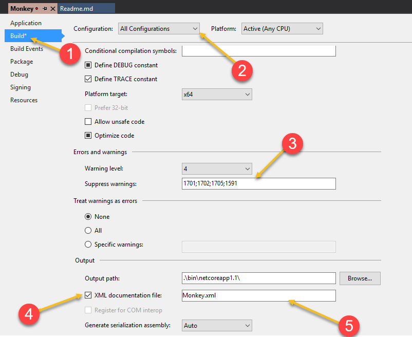


# Puppy.Api Document
> Project Created by [**Top Nguyen**](http://topnguyen.net)

## Enable Project Documentation xml file.

1. Right click on your Web API web project, select `Properties` or use can use shortcut `Alt + Enter`
2. Change to `Build` tab
3. Let select Configuration: `All Configurations` to make the setting apply for all configuration.
4. [Optional] you can forse all configuration run with `x64` bit (it better x86 or any CPU if your project always run on x64 machine) by select `x64` in `Platform Target` dropdown list.
5. [Optional] add `Suppress warnings` codes: `1701;1702;1705;1591`, if make project stop warning add `XML comment block` for all `Action` when you enable `Documentation` xml file.
6. Let enable `Documentation` xml by select checkbox `XML document file`, Visual Studio will auto add the path of xml file is `<Your Output Path>\<Your Name Space>.xml` but please change to `<Your Name Space>.xml`. You can change it if you want or just keep it to make `Puppy.Api Document` work well.
7. Try to build project and see your documentation xml file generated in the path config by above step, right click on the file and select `Property` then make the file `always copy` to out put folder (it help the deploy package always have descrption for all API) or you can do it in .csproj

**Other way is copy code below and put into your `.cspoj`**
```xml
  <!-- Generate Documentation XML -->
  <PropertyGroup Condition="'$(Configuration)|$(Platform)'=='Debug|AnyCPU'">
    <DocumentationFile><your aseembly name>.xml</DocumentationFile>
    <OutputPath>.\bin\</OutputPath>
    <NoWarn>1701;1702;1705;1591</NoWarn>
    <PlatformTarget>x64</PlatformTarget>
  </PropertyGroup>

  <PropertyGroup Condition="'$(Configuration)|$(Platform)'=='Release|AnyCPU'">
    <DocumentationFile><your aseembly name>.xml</DocumentationFile>
    <OutputPath>.\bin\</OutputPath>
    <NoWarn>1701;1702;1705;1591</NoWarn>
    <PlatformTarget>x64</PlatformTarget>
  </PropertyGroup>

  <!-- Copy Output folder -->
  <!--<CopyToOutputDirectory>Always</CopyToOutputDirectory>-->
  <!-- <CopyToOutputDirectory>PreserveNewest</CopyToOutputDirectory> -->
  <ItemGroup>
    <!-- Documentation XML -->
    <None Update="Monkey.xml">
      <CopyToOutputDirectory>Always</CopyToOutputDirectory>
    </None>
  </ItemGroup>
```

## Config
- Add config section to `appsettings.json`
- If you not have custom setting in appsettings.json, `default setting` will be apply.

```json
"ApiDocument": {
    // Api Document Html Title: Name of API Document in HTML
    "ApiDocumentHtmlTitle": "API Document",

    // Access Key Query Param: name of parameter to check can access api document or not
    "AccessKeyQueryParam": "key",

    // Access Key: access key to check with AccessKeyQueryParam - empty is allow annonymous
    "AccessKey": "",

    // Authenticate Token Prefix
    "AuthTokenKeyPrefix": "Bearer",

    // Api Document Url: relative URL with start and end by "/", be careful this may replace or be replace by MVC route
    "ApiDocumentUrl": "/.well-known/api-configuration/",

    // Api Document Name/Version: the path of document URL
    "ApiDocumentName": "latest",

    // Api Document Json File: the file name of json define api.
    "ApiDocumentJsonFile": "all.json",

    // => SO API JSON DOC Endpoint is "/.well-known/api-configuration/latest/all.json"

    // Api Contact Information
    "Contact": {
        "Name": "Top Nguyen",
        "Url": "http://topnguyen.net",
        "Email": "topnguyen92@gmail.com"
    },

    // Enable describe all enums as string - default is true
    "IsDescribeAllEnumsAsString": true,

    // Enable discribe all parameter in camel case - default is true
    "IsDescribeAllParametersInCamelCase": true
}
```

---

## Add Service
- If you use default documentation file path (the xml file in output folder and same name with the assembly).
- Then use `services.AddApiDocument(<your assembly>, <ConfigurationRoot instance>, <config section key name in appsettings.json>)`
- The below is sample to use `Puppy.Api Document` with custom documentation xml file path.

```csharp
// [API Document] Api Document
services.AddApiDocument(typeof(Startup).GetTypeInfo().Assembly, ConfigurationRoot, "ApiDocument")

// With Puppy.Core
services.AddApiDocument(typeof(Startup).GetAssembly(), ConfigurationRoot, "ApiDocument");
```

- If you setup custom xml file path for your Documentation xml file, then use `services.AddApiDocument(<your  documentation xml absolute file path>, <ConfigurationRoot instance>, <config section key name in appsettings.json>)`
- The below is sample to use `Puppy.ApiDocument` with custom documentation xml file path.
```csharp
// [API Document] Api Document
services.AddApiDocument(Path.Combine(Directory.GetCurrentDirectory(), "Documentation.xml"), ConfigurationRoot, "ApiDocument");
```

- If you setup custom xml file path. Remember to add in your .csproj `always copy` for your xml file to make sure it in publish package when you `Publish`.
- This below is sample to config **copy always** to output folder.

```xml
    <None Update="<your documentation file relative path>.xml">
      <CopyToOutputDirectory>Always</CopyToOutputDirectory>
    </None>
```

---

## Use Application Builder

```csharp
// [API Document] Api Document
app.UseApiDocument();
```

---

## Enable Api Document UI

Now you have Api Document Service, let add route for Api Document.
This sample below is use `Developers` area as route for Api Document.

```csharp
[Route("")]
[HttpGet]
[ServiceFilter(typeof(ApiDocAccessFilter))]
public IActionResult Index() => Helper.GetApiDocHtml(Url, Url.AbsoluteAction("JsonViewer", "Developers", new { area = "Developers" }));

[Route("JsonViewer")]
[HttpGet]
[ServiceFilter(typeof(ApiDocAccessFilter))]
public IActionResult JsonViewer() => Helper.GetApiJsonViewerHtml(Url);
```

`GetApiDocHtml()` and `GetApiJsonViewerHtml()` already have css, js and html inside configuration depend on `Config` object.
